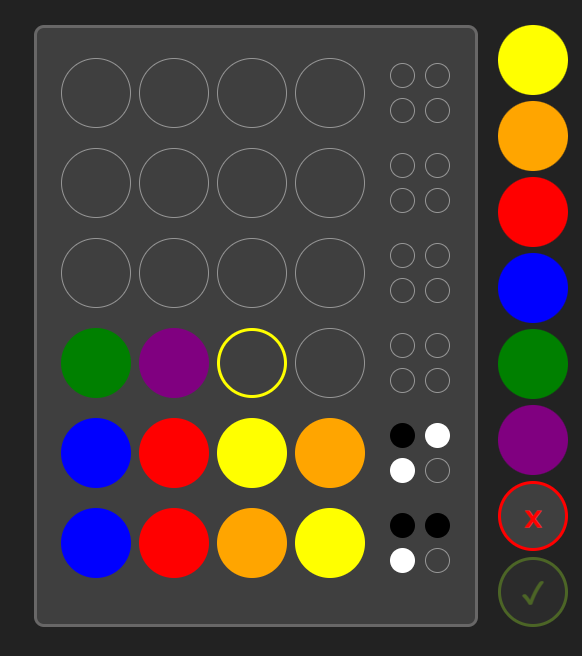

# Mastermind

Simulation of the Mastermind game built in HTML, CSS, and Vanilla Javascript. Check game rules [here](pages/rules.html).



## Development

I used the observer design pattern to update the board view as the game state changed. To achieve this, I created an initial state that stores, among other things, the position of the board cells and their color. 

In the development, I used Javacript exclusively, but I wrote the game state interface in Typescript for better visibility.

```ts
interface GameState {
  currentRowPosition: number;
  currentCellPosition: number;
  secretRow: SecretRow;
  public: {
    username: string;
    loss: boolean;
    victory: boolean;
    difficulty: {
      title: string;
      maxAttempts: number;
      colorsQuantity: number;
    };
    rows: Row[];
  },
};

// This is the secret combination to uncover.
interface SecretRow {
  secretCells: {
    position: number;
    color: string;
  }[]
}

// Each row of the board.
interface Row {
  position: number;
  cells: Cell[];
  clues: Clue[];
}

// Each cell of a row.
interface Cell {
  rowPosition: number;
  position: number;
  color: string | null;
}

// Each clue of a row. These are white or black according to the result.
interface Clue {
  color: string | null;
}
```